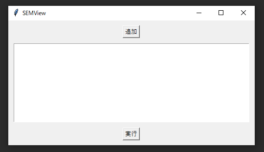
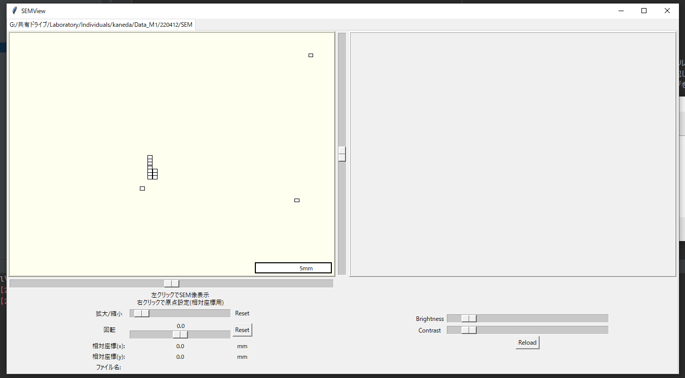

# SEMView
Viewer for SEM Images
python 3.10

## 必要なライブラリ
* pandas
* pillow

## 使い方
1. Pythonの環境構築をし，pipで上記ライブラリをインストール．
2. `python SEMView.py`
3. 以下のような画面が表示される．`追加`から見たいフォルダを選択し，`実行`．

4. 左側にSEM像の位置，大きさが表示される．スケールバーは信用しないでください．
5. 右クリックで原点設定（緑になる）できて，左クリックした像（赤くなる）の相対座標が出る．

# EasySEMView
SEM画像を合成します．

Low MagnificationとHigh Maginificationは座標がずれるので混ぜないほうが良いです．

python 3.10を想定しています．

## 必要ライブラリ
* pandas
* pillow

## 使い方
1. Pythonの環境構築をし，pipで上記ライブラリをインストール．
2.  `python EasyView.py`
3. 以下のような画面が表示される．`追加`から見たいフォルダを選択し，`実行`．1260x960はかなり大きめなので，小さく調整してもよい．

4. Brightness, Contrastを調整可能．Saveから画像を保存可能．
